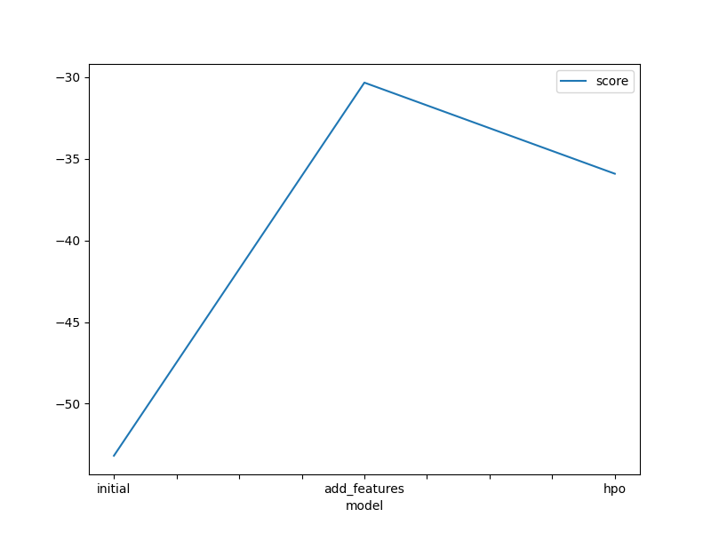
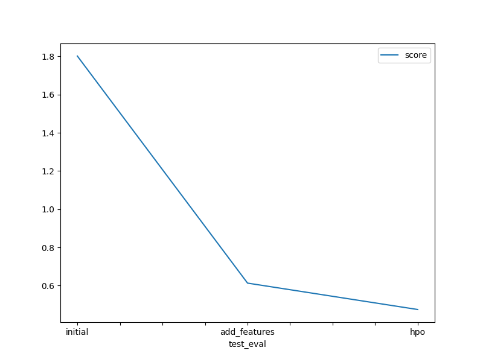

# Report: Predict Bike Sharing Demand with AutoGluon Solution
#### Areej Fatima

## Initial Training
### What did you realize when you tried to submit your predictions? What changes were needed to the output of the predictor to submit your results?
I realized that when we need to submit the pridictions, these should be non-negative becuase kaggle don't accept the predictions with negative values. So, We need to replace all the negative predictions with zero before submitting it to the kaggle.

### What was the top ranked model that performed?
The top ranked model is the third one (hyperparameter optimized model) with score of 0.4747. This model was developed by the hyperparameter optimization. 

## Exploratory data analysis and feature creation
### What did the exploratory analysis find and how did you add additional features?
By exploratory data analysis we observed the distribution of values of numerical columns. We observed the skewness count, registered and casual.
we engineered new features (`year, month, day, hour`) based on the feature `datetime`, in order to improve the performance of our model.

### How much better did your model preform after adding additional features and why do you think that is?
By adding the additional feature the performance of model improved upto the 0.613 in comparison to the initial model(1.8015) where 'datetime' column was used. The  model performance also improved after converting the datatype of certain catagorical columns from (integer) datatype to the (catagorical) datatype. So we can infer from this that AutoGluon better used the saperate ('year','month','day','hour') columns to improve the performance instead of single datetime column.   

## Hyper parameter tuning
### How much better did your model preform after trying different hyper parameters?
My model perform better with score of 0.4747 in comparison to the previous new_feature model whose score was 0.6130.
There are some observations: 
The 'time_limit' and 'presets' parameters are quite crucial, While performing hyperparameter optimization in autogluon.
When we tune the model with hyperparameters with fixed set of values by the user, this action limits the autogluon to explore more for finding best. 

### If you were given more time with this dataset, where do you think you would spend more time?
If I were given more time on this dataset. I would like to invest my time in hyperparameter Optimization and tried to find the best set of hyperparameters for the better performance of model.

### Create a table with the models you ran, the hyperparameters modified, and the kaggle score.
|model|presets|time-limit|others|score|
|--|--|--|--|--|
|initial|'best_quality'|600|NaN|1.8015|
|add_features|'best_quality'|600|NaN|0.6130|
|hpo|'best_quality'|720|nn: activation/batch_size/learning_rate/dropout_prob, gbm:num_boost_round/num_leaves|0.4747|

### Create a line plot showing the top model score for the three (or more) training runs during the project.

### Create a line plot showing the top kaggle score for the three (or more) prediction submissions during the project.

## Summary
We fully utilized the capabilities of AutoGluon framework. It helps in creating distinct regression models and assisted in quickly prototyping a baseline model. Hyperparameter tuning by using AutoGloun helped in improving performance over the initial baseline model. If we further spent some more time in hyperparameter optimizaion, then we could be able to get a model with best performance. 
